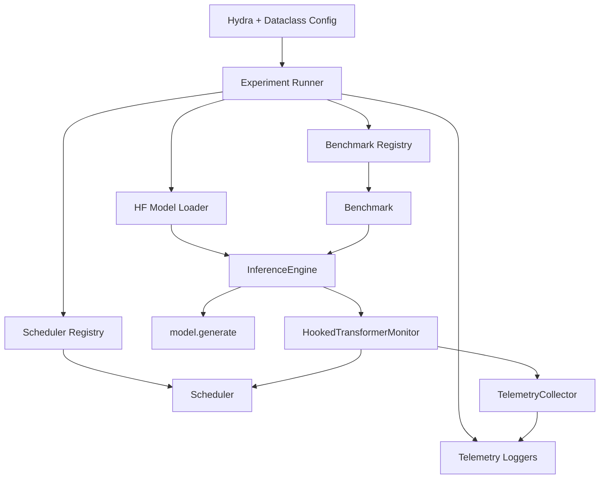
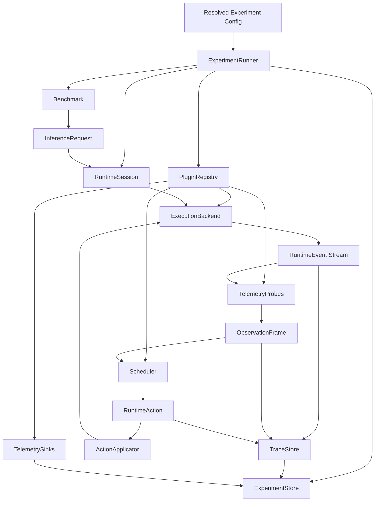
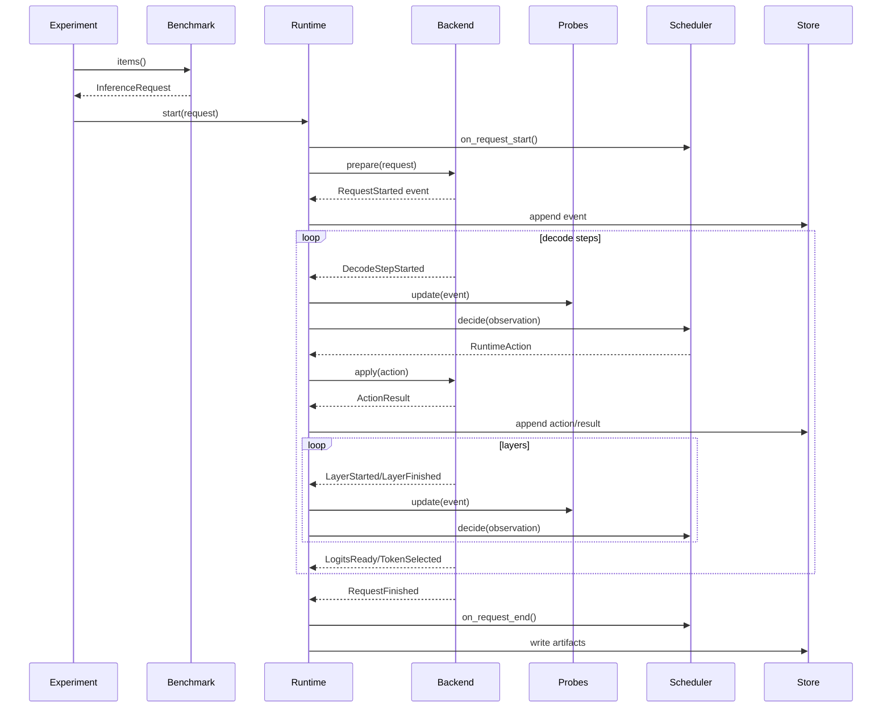
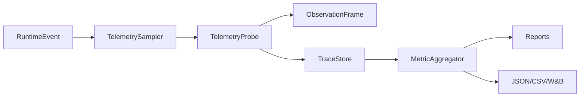
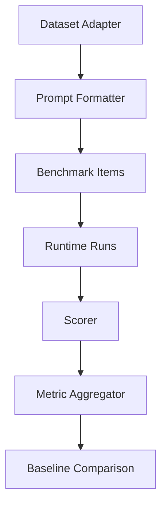

# RFC: ComputeOS V2 Adaptive Inference Research Platform

- Status: Draft
- Authors: ComputeOS maintainers
- Target version: V2
- Last updated: 2026-06-28

## Summary

ComputeOS V2 evolves the current hook-based telemetry scaffold into a modular
adaptive inference research platform. The goal is to make novel runtime
scheduling algorithms easy to prototype, benchmark, compare, and publish without
rewriting model code or coupling policies to one inference backend.

V2 introduces a runtime control plane around the existing scheduler, telemetry,
benchmark, and experiment foundations. The control plane separates observation,
decision-making, and action application:

1. backends emit runtime events
2. telemetry probes transform events into signals
3. schedulers consume context and emit actions
4. action applicators validate and enforce supported actions
5. experiments record traces, metrics, artifacts, and comparisons

This keeps ComputeOS distinct from production serving engines. It is not trying
to replace vLLM, TensorRT-LLM, SGLang, Hugging Face Transformers, or PyTorch.
ComputeOS should become the research layer where adaptive inference policies are
designed, evaluated, and eventually ported to high-performance backends.

## Goals

- Preserve backwards compatibility with the current `Scheduler` API where
  possible.
- Support adaptive runtime intelligence beyond fixed heuristics.
- Decouple policies from Hugging Face `generate`.
- Make runtime action support explicit and backend-specific.
- Make telemetry signals composable, sampleable, and benchmarkable.
- Allow third-party schedulers, benchmarks, probes, and backends as plugins.
- Keep default tests deterministic, offline, and fast.
- Produce experiment artifacts suitable for papers: configs, traces, metrics,
  baselines, plots, and reproducibility metadata.

## Non-Goals

- Replace production inference servers.
- Implement every scheduling algorithm in core.
- Require model weight modification.
- Require GPU hardware for default tests.
- Force all backends to support all runtime actions.
- Optimize ahead of measurement.

## Design Principles

1. **Interfaces over inheritance.** Use protocols and small dataclasses for
   runtime boundaries.
2. **Dependency injection over globals.** Registries and stores should be passed
   into runners.
3. **Observation and control are separate.** Hooks observe; runtime controllers
   decide when to ask policies and how to apply actions.
4. **Backends declare capabilities.** A scheduler may request `SKIP_LAYER`, but
   the backend decides whether it is supported.
5. **Telemetry is an event stream.** Metrics and reports are derived artifacts.
6. **Determinism is a feature.** Experiments must capture seeds, configs,
   versions, and backend metadata.
7. **Research code should be small.** A new scheduler should fit in a few
   hundred lines and should not need to understand the full runtime.

## Current Architecture



Strength: simple, readable, and non-invasive.

Weakness: hooks directly call schedulers, and scheduler actions are recorded but
not enforced.

## Proposed V2 Architecture



## Core Concepts

### ExecutionBackend

An `ExecutionBackend` owns model execution. Backends may be:

- Hugging Face generate backend
- controllable PyTorch decode-loop backend
- vLLM adapter
- SGLang adapter
- TensorRT-LLM adapter
- synthetic deterministic test backend

Proposed interface:

```python
class ExecutionBackend(Protocol):
    @property
    def capabilities(self) -> BackendCapabilities: ...

    def prepare(self, request: InferenceRequest) -> RuntimeSession: ...

    def run(self, session: RuntimeSession) -> Iterator[RuntimeEvent]: ...

    def apply(self, session: RuntimeSession, action: RuntimeAction) -> ActionResult: ...
```

The current `InferenceEngine` becomes a compatibility wrapper over a
`HuggingFaceGenerateBackend`.

### BackendCapabilities

Capabilities describe which actions a backend can enforce:

- observe layers
- observe logits
- observe attention
- skip layers
- early exit
- adjust KV cache
- change precision
- reorder batches
- stream tokens
- expose CUDA events
- expose distributed rank metrics

Schedulers can require capabilities or degrade gracefully when unavailable.

### RuntimeEvent

Runtime events are immutable records emitted by backends:

- `RequestStarted`
- `DecodeStepStarted`
- `LayerStarted`
- `LayerFinished`
- `LogitsReady`
- `TokenSelected`
- `CacheUpdated`
- `ActionApplied`
- `RequestFinished`
- `RuntimeError`

Each event should include:

- request ID
- run ID
- timestamp
- backend name/version
- token index when applicable
- layer index/name when applicable
- batch index when applicable
- device/rank when applicable

### ObservationFrame

An `ObservationFrame` is the scheduler-facing view of current runtime state. It
is derived from events and telemetry probes.

It should be smaller and more stable than raw telemetry:

- current token index
- current layer index
- cumulative latency
- recent activation summaries
- confidence features
- entropy features
- memory features
- backend capabilities
- allowed actions

### RuntimeAction

Actions are scheduler requests:

- `Continue`
- `RecordOnly`
- `EarlyExit`
- `SkipLayer`
- `AdjustCache`
- `AdjustPrecision`
- `RequestMoreCompute`
- `DeferToken`
- `Rebatch`

Each action must be validated against backend capabilities before application.

### ActionResult

Action results make scheduling auditable:

- accepted
- rejected unsupported
- rejected unsafe
- applied
- downgraded
- no-op

This is critical for research papers. A policy claiming to skip layers must
prove the runtime actually skipped layers.

## Runtime Lifecycle



## Scheduler Lifecycle

Current:

```text
reset -> decide -> observe
```

V2 proposed lifecycle:

```text
configure
on_experiment_start
on_request_start
on_decode_step_start
on_layer_start
on_layer_end
on_logits
decide
observe_action_result
on_request_end
on_experiment_end
```

Backwards compatibility:

- Existing schedulers continue to implement `reset`, `decide`, and `observe`.
- An adapter maps V2 observation frames into current `SchedulerContext`.
- New schedulers may implement richer optional lifecycle methods.

## Telemetry Lifecycle



Telemetry should move from per-request mutable lists to event traces plus
derived metrics.

### Signal Types

- latency
- CUDA event timing
- CPU time
- activation summaries
- attention entropy
- logits confidence
- token probability margin
- hidden-state drift
- KV-cache size
- memory allocation
- batch utilization
- accepted/rejected actions
- quality metrics

### Sampling

Sampling must be explicit and deterministic:

- sample every N layers
- sample specific layer ranges
- sample warmup versus measurement phases
- sample tensors by feature dimension
- sample events by token index

## Plugin Architecture

ComputeOS should support plugins for:

- schedulers
- telemetry probes
- execution backends
- benchmark adapters
- metric aggregators
- report generators

Proposed package metadata:

```toml
[project.entry-points."computeos.schedulers"]
market = "my_package.market:factory"

[project.entry-points."computeos.backends"]
hf_controlled = "my_package.backends:factory"
```

Plugin metadata should include:

- name
- version
- config schema
- required telemetry
- required backend capabilities
- supported model families
- determinism notes
- citation info

## Experiment Lifecycle

Every experiment should produce an artifact directory:

```text
outputs/<experiment_id>/
  config.yaml
  environment.json
  model.json
  backend.json
  scheduler.json
  traces/
  metrics.json
  summary.md
  plots/
```

Experiment lifecycle:

1. resolve config
2. assign run ID
3. snapshot environment
4. load plugins
5. build backend and scheduler
6. prepare benchmark
7. run baseline if configured
8. run scheduled policy
9. aggregate metrics
10. write artifacts
11. optionally log W&B

## Benchmark Lifecycle

Benchmarks should become first-class evaluation units:



Benchmark objects should define:

- dataset source
- prompt formatting
- generation settings
- scoring function
- aggregation function
- deterministic limits
- quality metrics

## Comparison With Existing Systems

### vLLM

vLLM is a high-throughput serving engine optimized around PagedAttention,
continuous batching, and efficient memory management. It focuses on production
serving throughput and latency.

ComputeOS differs by focusing on research instrumentation and scheduling policy
experimentation. A V2 vLLM backend should expose vLLM events and capabilities,
but ComputeOS should not duplicate vLLM serving internals.

### TensorRT-LLM

TensorRT-LLM optimizes inference kernels and deployment graphs for NVIDIA GPUs.
It is performance-first and compilation-oriented.

ComputeOS differs by being policy-first. TensorRT-LLM may be a target backend
for policies that have matured, but early research needs flexible observation
and control more than maximum kernel throughput.

### SGLang

SGLang provides structured generation and serving primitives for efficient LLM
program execution. It is strong at orchestrating generation workflows.

ComputeOS differs by treating adaptive compute scheduling as the core research
object. SGLang integration would be valuable for workflow-level scheduling, but
ComputeOS should keep scheduler evaluation independent from any one serving DSL.

### Hugging Face Transformers

Transformers is the reference model ecosystem. It provides broad model support,
`generate`, and easy experimentation.

ComputeOS uses Transformers as the default accessibility backend. V2 should add
a more controllable Transformers backend while preserving the simple
`model.generate` path for smoke tests.

### PyTorch

PyTorch is the tensor and module substrate. Hooks make ComputeOS possible
without rewriting models.

ComputeOS should use PyTorch for observability and custom controlled loops, but
it should avoid becoming a low-level kernel project. The framework belongs above
PyTorch, at the runtime policy and experiment layer.

## Design Decisions

### Keep Current Scheduler API as Compatibility Layer

Reason:

- existing examples and tests stay valid
- researchers can start with a tiny interface
- migration is incremental

Tradeoff:

- richer schedulers need optional lifecycle protocols

### Introduce Backend Capabilities

Reason:

- not all backends can skip layers or expose logits
- unsupported actions must be explicit
- research results must report applied actions, not requested actions

Tradeoff:

- policies need capability-aware design

### Use Event Streams Internally

Reason:

- events unify telemetry, actions, traces, and reports
- event logs are auditable
- streaming sinks avoid memory growth

Tradeoff:

- more schema design upfront

### Keep Hook Backend as First Backend

Reason:

- current implementation works
- zero model modification
- best path for compatibility

Tradeoff:

- Python hooks are not the final performance path

### Add Controlled PyTorch Backend Next

Reason:

- required to enforce early exit and layer skipping
- still model-research friendly
- easier than vLLM/TensorRT integration

Tradeoff:

- model architecture support must be incremental

## Backwards Compatibility

The following should continue to work:

```bash
computeos-run scheduler=heuristic
python examples/run_tiny_gpt2.py
python -m unittest discover -s tests
```

Existing classes should remain importable:

- `Scheduler`
- `SchedulerContext`
- `SchedulerDecision`
- `TelemetryCollector`
- `InferenceEngine`
- `Benchmark`

V2 should add adapters rather than remove these interfaces.

## Open Questions

1. Should V2 use Python `Protocol` types instead of abstract base classes?
2. Should event schemas be dataclasses or Pydantic models?
3. Should plugin config schemas use Hydra structured configs, Pydantic, or both?
4. How much backend control can be implemented generically across model families?
5. Should layer skipping be implemented via hooks, wrappers, or controlled loops?
6. How should ComputeOS report quality regressions for open-ended generation?
7. What is the minimal benchmark suite for credible adaptive inference claims?

## Future Research Roadmap

V2 should support:

- confidence-aware early exit
- layer skipping
- token-level compute budgeting
- adaptive KV cache policy
- precision scheduling
- memory-pressure scheduling
- compute market scheduling
- bandit and RL policies
- multi-agent runtime policies
- distributed rank-aware scheduling

Detailed algorithm proposals are in `RESEARCH_ROADMAP.md`.

## Adoption Strategy

1. Keep V1 examples working.
2. Add event schemas and traces behind current telemetry.
3. Add backend capability metadata.
4. Add action result logging without applying actions.
5. Add a controlled PyTorch backend for one small model family.
6. Implement one real adaptive action, likely early exit.
7. Add benchmark scorers and baseline comparison reports.
8. Publish a technical report with reproducible artifacts.
