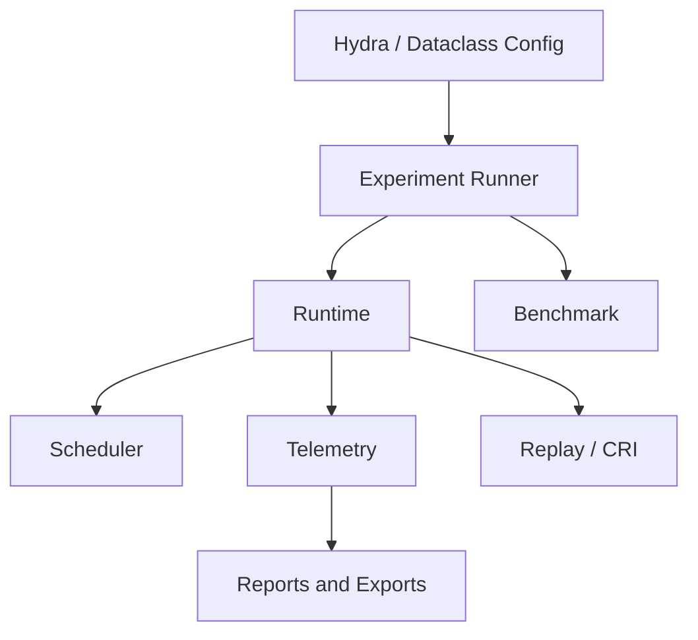
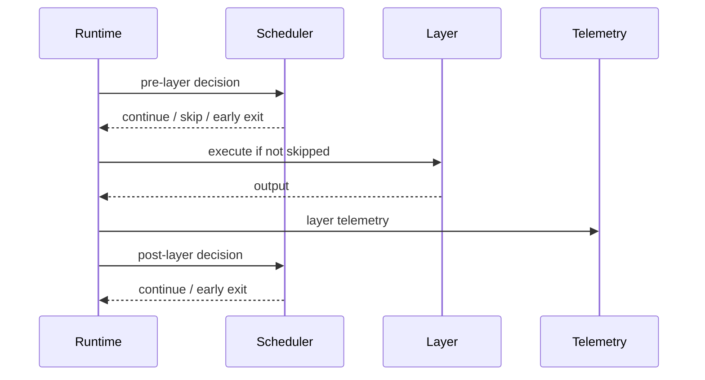
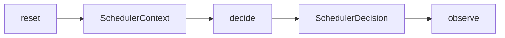
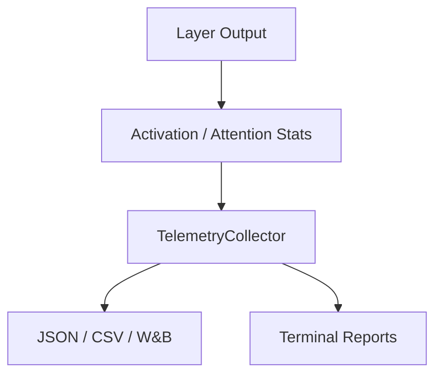
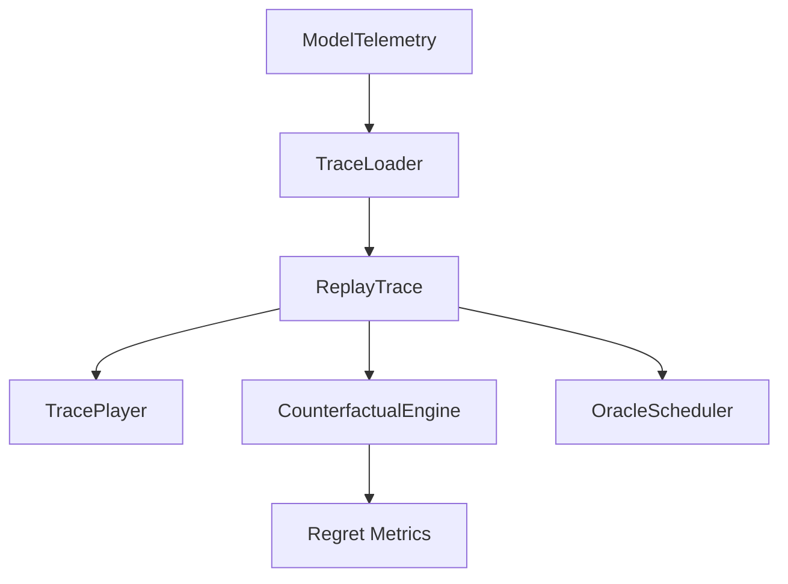
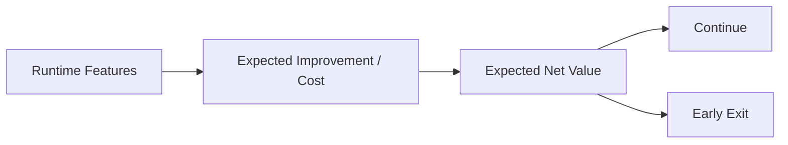
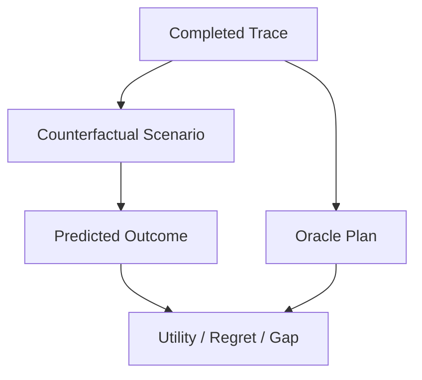
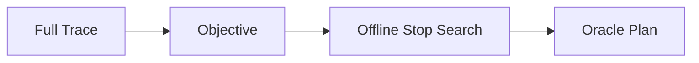

# ComputeOS Diagrams

## Overall Architecture

## Runtime Lifecycle

## Scheduler Lifecycle

## Telemetry Pipeline

## Replay System

## Predictive Value Scheduling

## Counterfactual Runtime Intelligence

## Oracle Scheduler

